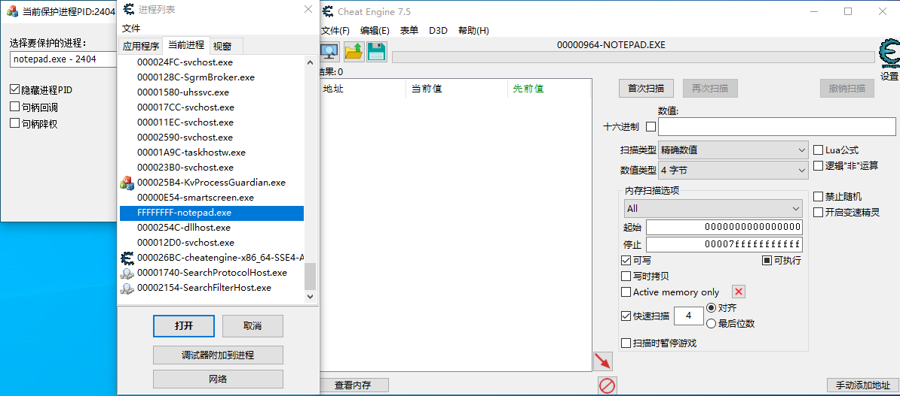
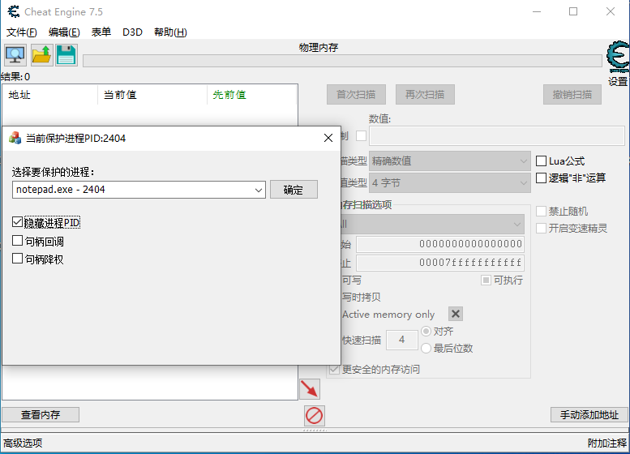
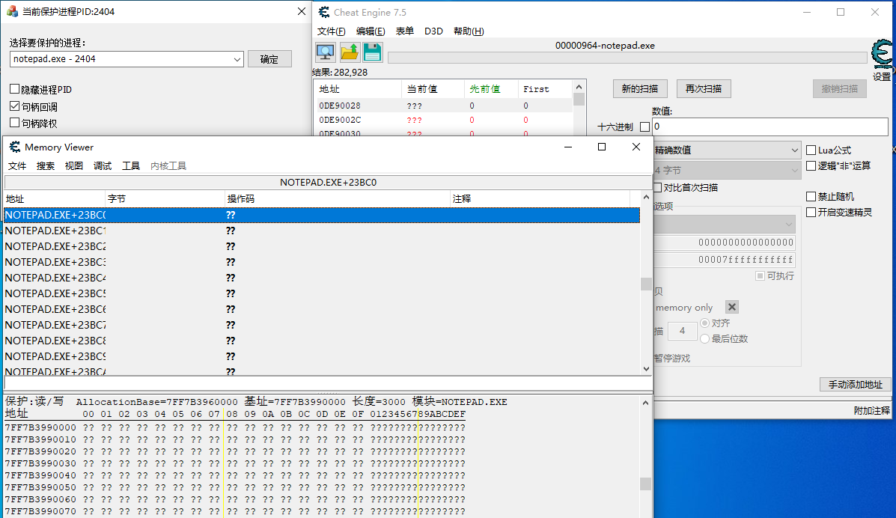
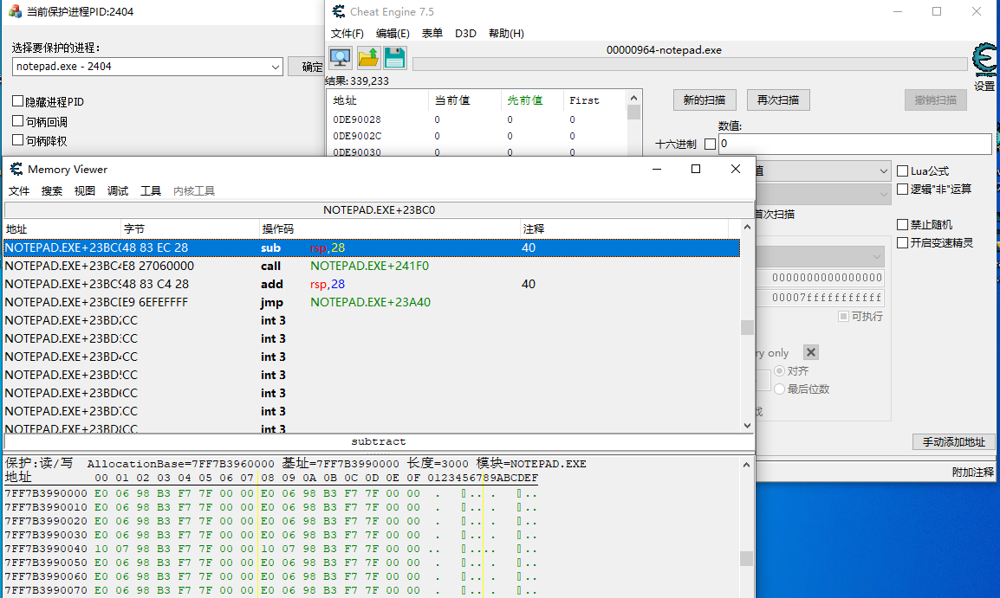

# 项目简介

该项目旨在开发一个进程保护的工具，实现防止其他程序如CE等对进程内存进行恶意搜索。

# 目前实现功能

## R3层

1. 实现进程枚举功能，直接从下拉框选择要保护的进程。
2. 提供多种保护方式的选择，如句柄回调，降权，隐藏PID等。
3. 启动程序的同时注册并加载驱动，结束程序时卸载和注销驱动。
4. 

## R0层

1. 实现IO通信功能，提供给R3调用接口。
2. 实现进程PID隐藏（关闭保护进程时需要取消勾选，否则蓝屏）。
3. 实现句柄回调，防止CE打开进程句柄。
4. 实现句柄降权，对CE私有句柄表中的保护进程的句柄降权处理。

# 效果图

 进程PID修改至-1

CE打开显示是物理内存，不能扫描

句柄回调

句柄降权

关闭所有保护

